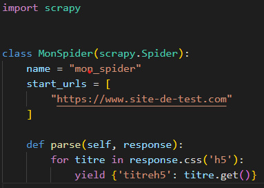
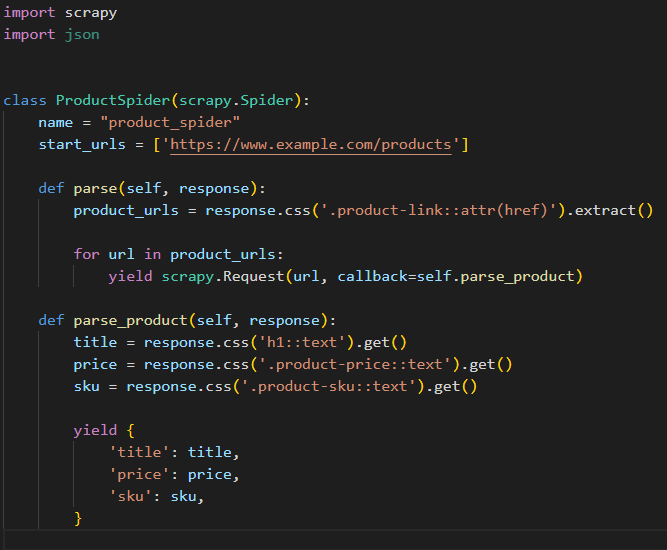

**Scrapy**

**Introduction:**

Scrapy is an open-source framework written in Python that allows for data retrieval from websites. It is a very useful tool for professionals in data analysis and web scraping. Web scraping is the process of collecting information from websites, and Scrapy provides a very efficient solution for performing this task.

**Concept :**

Scrapy is based on a pipeline architecture that allows for efficient data retrieval, storage, and processing. It is capable of navigating websites, retrieving necessary information, storing that information in a database, and processing it. Scrapy also uses extraction rules to extract specific data from websites.

**Theory :**

Scrapy is designed to be used with large-scale web scraping projects. It uses an asynchronous approach to navigate websites, which optimizes performance and reduces response time. Scrapy also uses a middleware system that allows users to customize the tool's behavior according to their needs.

**How to install :**

To install Scrapy, it is recommended to use the pip package manager. To do this, simply open a console and execute the command **pip install scrapy**. Scrapy is compatible with the Windows, Mac OS X, and Linux operating systems.

**Use case exemple :**
 

In this example, we have created a class called **MonSpider** that inherits from the **scrapy.Spider** class. We have also defined a list of **start\_urls** , which are the URLs from which Scrapy will begin to extract data. The **parse** method is called every time Scrapy navigates to a web page, and in this example, it extracts the **'h5' title** from the web pages.

**Alternatives to Scrapy :**

There are several alternatives to Scrapy for web scraping, such as **BeautifulSoup** , **Selenium** , and **PyQuery**. These tools can be useful for small to medium-scale web scraping projects. However, Scrapy remains the tool of choice for large-scale projects that require a more complex approach and better performance.

**Use case in data analysis:**

Data analysts can use Scrapy to collect market data, competitor information, social media data, and more.

Let's say we want to create a dataset of product prices, titles, etc. from an e-commerce site. We can use Scrapy to automatically extract price data from product web pages, save the data in a structured format such as CSV or JSON, and then use data analysis tools like Pandas to analyze the data and find trends and patterns. For example, consider the following code :

In this code example, we have defined a Scrapy spider (a class) called **ProductSpider**. The **parse** method extracts the URLs of all the products from the product list page and then calls the **parse\_product** method to extract data from each product page. The parse\_product method extracts the **title** , **price** , and **SKU** from each product page and stores them in a Python dictionary. Finally, each dictionary is returned to Scrapy for storage.

**Conclusion:**
Scrapy is a powerful web scraping framework that can be used for a variety of use cases. It provides a powerful set of tools for handling web scraping tasks, and it can be easily integrated into data analysis workflows. However, it's important to be mindful of ethical and legal considerations when using web scraping techniques.

**Useful links:**

Here's a list of references to learn more about the Scrapy framework:

- Official Scrapy documentation:[https://docs.scrapy.org/en/latest/](https://docs.scrapy.org/en/latest/)
- Official Scrapy tutorial: [https://docs.scrapy.org/en/latest/intro/tutorial.html](https://docs.scrapy.org/en/latest/intro/tutorial.html)
- Scrapy community on Reddit: [https://www.reddit.com/r/scrapy/](https://www.reddit.com/r/scrapy/)
- Scrapy community on Stack Overflow: [https://stackoverflow.com/questions/tagged/scrapy](https://stackoverflow.com/questions/tagged/scrapy)